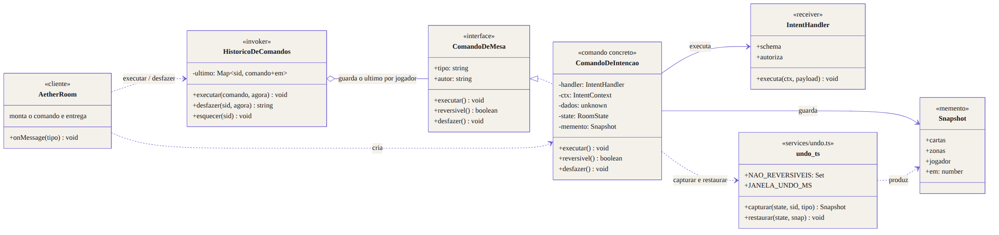
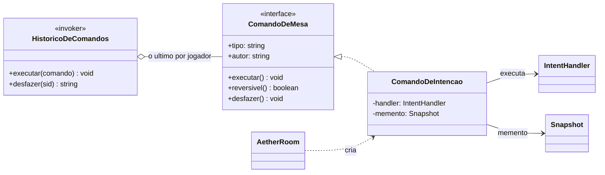
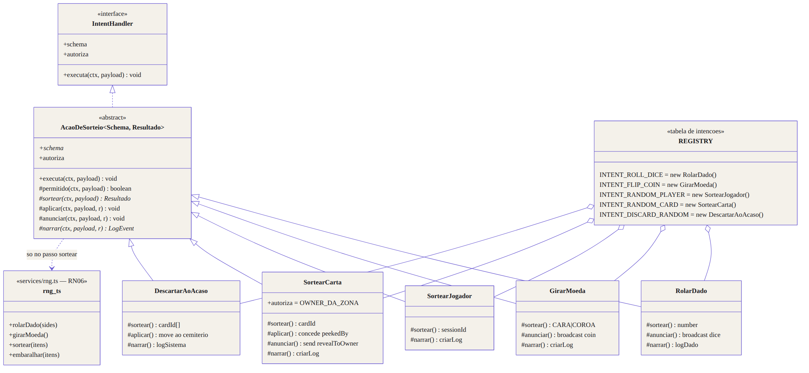
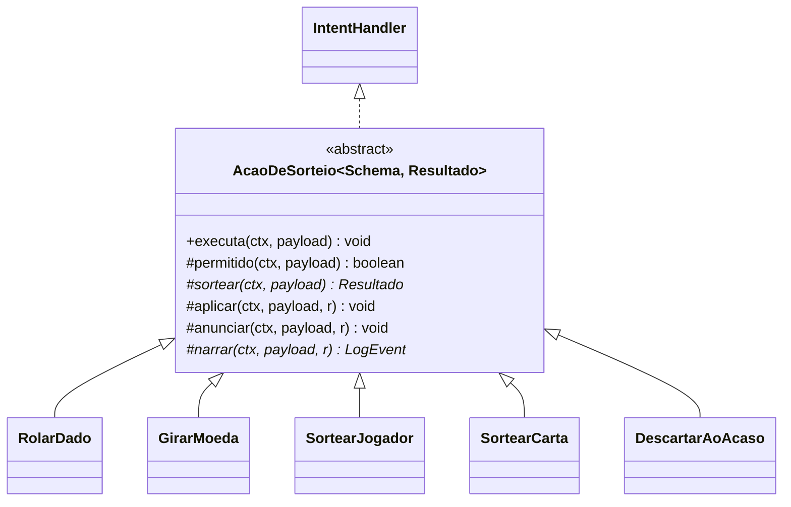

# Padrões: Command e Template Method

| Campo                   | Valor                                                                                                                                       |
| ----------------------- | ------------------------------------------------------------------------------------------------------------------------------------------- |
| **ID**                  | `DOC-097`                                                                                                                                   |
| **Status**              | Ativo                                                                                                                                       |
| **Vale para**           | `apps/game-server`                                                                                                                          |
| **Código**              | `src/intents/comandos.ts`, `src/intents/sorteios.ts`, `src/services/mesa.ts`                                                                |
| **Documentos vizinhos** | [`DOC-021`](documento_de_arquitetura.md), [`DOC-031`](especificacao_websocket_e_eventos.md), [`DOC-032`](especificacao_do_motor_sandbox.md) |

---

## 1. O que este documento cobre

| Padrão              | Onde                        | Problema que resolve                                                                  |
| ------------------- | --------------------------- | ------------------------------------------------------------------------------------- |
| **Command**         | desfazer (`INTENT_UNDO`)    | a ação e a capacidade de desfazê-la eram duas coisas ligadas por disciplina           |
| **Template Method** | a família de ações ao acaso | cinco handlers com o mesmo esqueleto, e duas regras do projeto que ninguém verificava |

Nenhum dos dois muda o comportamento visível da mesa.

---

## 2. Command

### 2.1 O problema, em concreto

Desfazer funcionava, mas morava em três lugares que precisavam concordar sem
nunca se falarem:

```ts
// AetherRoom, no despacho:
this.jornal.registrar(this.state, client.sessionId, tipo); // captura
handler.executa(contexto, parsed.data); // muta
```

1. **A ordem era convenção.** Inverter essas duas linhas não quebra teste
   nenhum — e faz o snapshot sair **depois** da mutação, o que transforma
   `INTENT_UNDO` num no-op silencioso: o jogador clica, o log diz que desfez, e
   nada volta.
2. **A política de reversibilidade vivia longe da ação**, numa lista de nomes
   dentro de `services/undo.ts`.
3. **`INTENT_UNDO` era um handler comum** pedindo `ctx.desfazer()`, sem relação
   visível com o que tinha sido feito antes.

### 2.2 O desenho



Fonte do diagrama: [`diagramas/command.mmd`](diagramas/command.mmd).



### 2.3 Os papéis do padrão

| Papel GoF         | Neste código                                                       |
| ----------------- | ------------------------------------------------------------------ |
| `Command`         | `ComandoDeMesa`                                                    |
| `ConcreteCommand` | `ComandoDeIntencao` — carrega handler, contexto, payload e memento |
| `Invoker`         | `HistoricoDeComandos` — executa e guarda o último por jogador      |
| `Receiver`        | o `IntentHandler` do `REGISTRY`                                    |
| `Client`          | `AetherRoom`, que monta o comando no despacho                      |
| `Memento`         | `Snapshot`, de `services/undo.ts`                                  |

O despacho ficou assim:

```ts
this.historico.executar(new ComandoDeIntencao(tipo, handler, contexto, parsed.data, this.state));
```

Capturar deixou de ser uma linha que alguém precisa lembrar de pôr antes: é a
primeira coisa que `ComandoDeIntencao.executar` faz, e só ela sabe se o comando
é reversível.

### 2.4 Por que undo por memento, e não por operação inversa

A forma "canônica" do Command guarda o inverso da ação. Aqui isso seria um
inverso por intenção, noventa e seis vezes — e o inverso de "embaralhou e
comprou três" não existe sem guardar a ordem anterior de qualquer maneira.

O recorte do snapshot continua sendo exatamente o que pertence ao jogador: as
cartas de que ele é dono, as listas de ordem das zonas dele e os marcadores do
próprio `Player`. Restaurar mais que isso deixaria de ser "desfazer" e viraria
"reescrever a mesa".

### 2.5 O que `services/undo.ts` é agora

Só o memento: `capturar`, `restaurar`, `JANELA_UNDO_MS` e `NAO_REVERSIVEIS` —
esta última com a explicação de cada entrada, que continua sendo o melhor lugar
para ela. O `JornalUndo` saiu; quem faz aquele papel é o `HistoricoDeComandos`.

---

## 3. Template Method

### 3.1 A família

Cinco intenções ao acaso: `ROLL_DICE`, `FLIP_COIN`, `RANDOM_PLAYER`,
`RANDOM_CARD` e `DISCARD_RANDOM`. Elas não parecem iguais — uma muta estado,
outra só transmite um evento, outra só escreve no log — mas todas fazem os
mesmos cinco passos, nesta ordem:

1. checar se pode;
2. **sortear** — e este é o único passo que toca `services/rng.ts`;
3. aplicar o resultado no estado, se houver o que aplicar;
4. anunciar a quem tem direito de ver;
5. registrar no log.

### 3.2 O desenho



Fonte do diagrama: [`diagramas/template_method.mmd`](diagramas/template_method.mmd).



### 3.3 O que o esqueleto garante que cinco funções soltas não garantiam

**RN06 — aleatoriedade só por `services/rng.ts`.** Com o sorteio confinado a um
passo com nome, "onde entra o acaso nesta ação?" tem uma resposta, e o revisor
sabe onde olhar. Antes, a chamada ao CSPRNG ficava no meio do corpo de cada
handler, misturada à mutação.

**Auditoria — todo sorteio aparece no log.** `narrar` é **abstrato**: não existe
subclasse que esqueça de registrar, porque quem chama `ctx.log` é o esqueleto e
a subclasse não compila sem a frase. O log da mesa é o que permite a uma mesa
desconfiada conferir o que aconteceu (`DOC-032` §RNG).

**A ordem.** Anunciar antes de aplicar mandaria a mesa desenhar um resultado que
o estado ainda não tem; registrar antes de sortear registraria a intenção, e não
o que saiu.

### 3.4 Passos, ganchos e o que cada subclasse escreve

| Passo       | Tipo         | Padrão       |
| ----------- | ------------ | ------------ |
| `permitido` | gancho       | `true`       |
| `sortear`   | **abstrato** | —            |
| `aplicar`   | gancho       | não faz nada |
| `anunciar`  | gancho       | não faz nada |
| `narrar`    | **abstrato** | —            |

| Subclasse          | sortear              | aplicar            | anunciar                | narrar       |
| ------------------ | -------------------- | ------------------ | ----------------------- | ------------ |
| `RolarDado`        | `rolarDado`          | —                  | `broadcast('dice')`     | `logDado`    |
| `GirarMoeda`       | `girarMoeda`         | —                  | `broadcast('coin')`     | `criarLog`   |
| `SortearJogador`   | `sortear`            | —                  | —                       | `criarLog`   |
| `SortearCarta`     | `sortear`            | concede `peekedBy` | `send('revealToOwner')` | `criarLog`   |
| `DescartarAoAcaso` | `embaralhar` + corte | move ao cemitério  | —                       | `logSistema` |

`SortearCarta` é a razão de `anunciar` receber o `ctx` inteiro em vez de um
"broadcast": **quem decide o alcance é a subclasse**, e ali um broadcast vazaria
a mão. `DescartarAoAcaso` é a razão de `sortear` e `aplicar` serem passos
distintos: o handler antigo sorteava um índice, mexia na mão, sorteava outro —
o acaso e a mutação intercalados no mesmo laço.

### 3.5 Sem adaptador

`AcaoDeSorteio` implementa `IntentHandler`: tem `schema`, `autoriza` e
`executa`. A instância entra direto na tabela —

```ts
const INTENT_ROLL_DICE = new RolarDado();
```

— e o dispatcher não sabe que do outro lado há um método-template.

---

## 4. `services/mesa.ts`

`carta`, `ordem`, `nomeDe`, `atualizarContagens` e `aplicarEfeitosDeZona` eram
privadas de `intents/registry.ts`. Saíram para `services/mesa.ts` porque a
família de sorteio foi para outro arquivo: importá-las do registry criaria um
ciclo em tempo de execução (é o registry que monta os sorteios), e duplicar
`aplicarEfeitosDeZona` seria duplicar a regra mais fácil de errar do modelo — a
limpeza de concessões de visibilidade.

O código é o mesmo, num lugar onde as duas famílias alcançam.

---

## 5. Testes

| Arquivo                    | O que cobre                                                                                                              |
| -------------------------- | ------------------------------------------------------------------------------------------------------------------------ |
| `intents/comandos.spec.ts` | o que o undo restaura e o que ele recusa; que o snapshot sai **antes** da mutação; janela de 10 s; histórico por jogador |
| `intents/sorteios.spec.ts` | a ordem dos cinco passos (com uma subclasse-espiã), os dois pontos de parada, e cada intenção real                       |

`services/undo.spec.ts` virou `intents/comandos.spec.ts`: mudou de arquivo
porque mudou de dono. As asserções são as mesmas, mais três casos que só
passaram a existir com o padrão.

Os outros 167 testes continuam valendo sem alteração.
