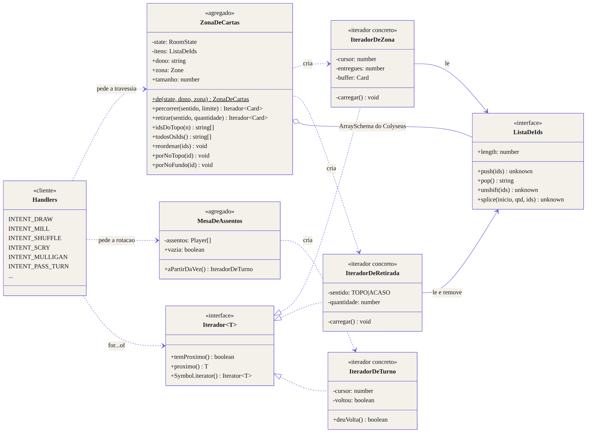
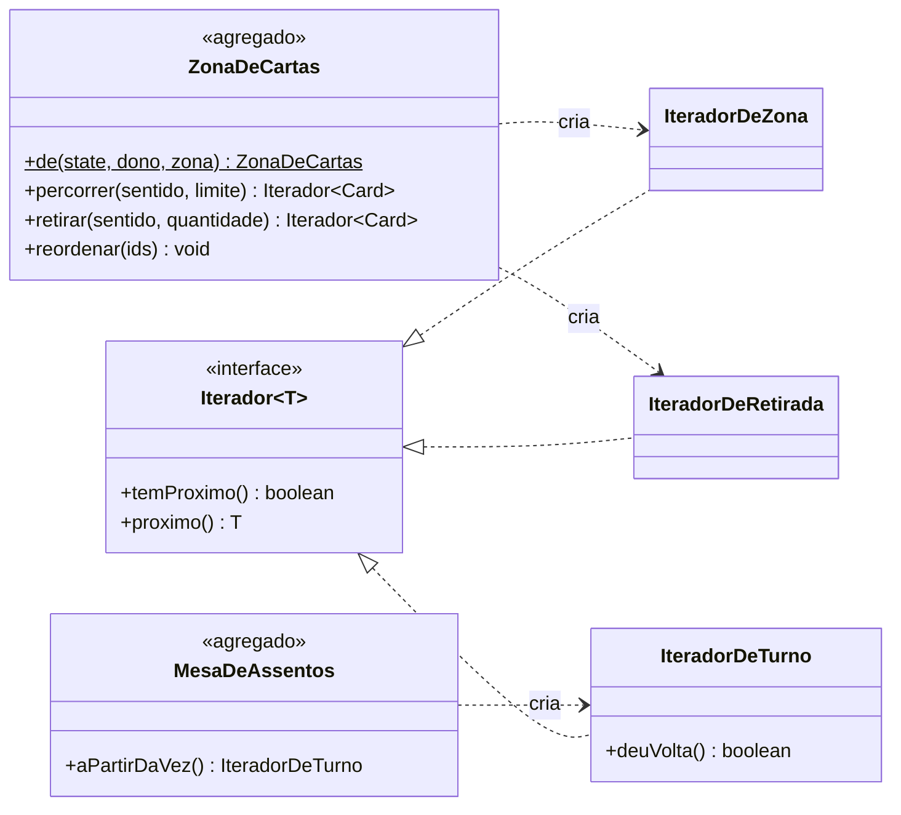
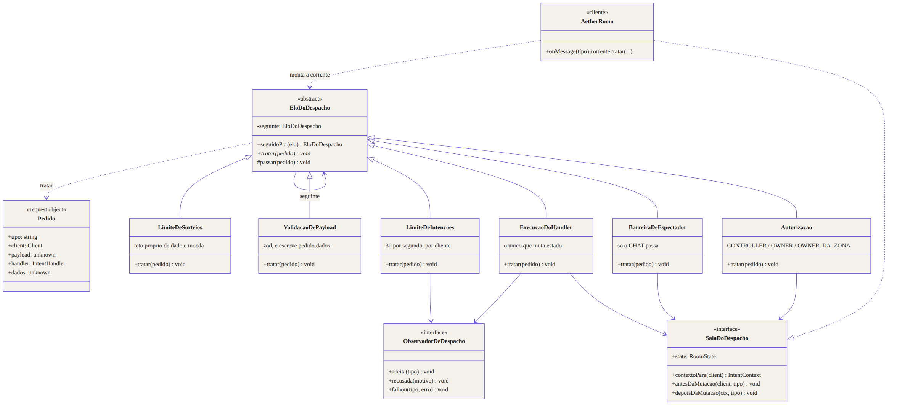
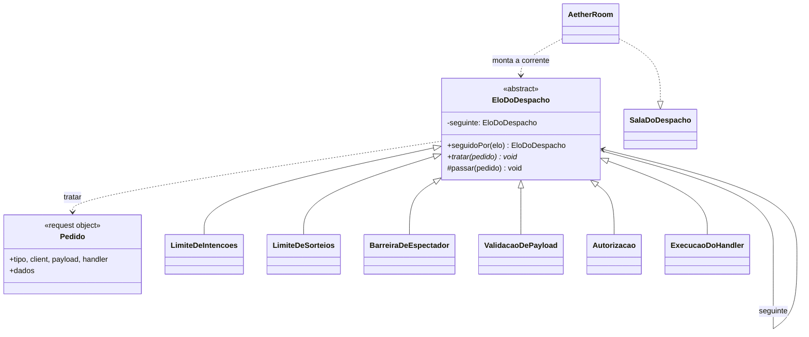

# Padrões: Iterator e Chain of Responsibility

| Campo                   | Valor                                                                                                                                       |
| ----------------------- | ------------------------------------------------------------------------------------------------------------------------------------------- |
| **ID**                  | `DOC-096`                                                                                                                                   |
| **Status**              | Ativo                                                                                                                                       |
| **Vale para**           | `apps/game-server`                                                                                                                          |
| **Código**              | `src/services/iteradores.ts`, `src/intents/pipeline.ts`                                                                                     |
| **Documentos vizinhos** | [`DOC-021`](documento_de_arquitetura.md), [`DOC-031`](especificacao_websocket_e_eventos.md), [`DOC-032`](especificacao_do_motor_sandbox.md) |

---

## 1. O que este documento cobre

Dois padrões do catálogo GoF aplicados ao **game-server**, cada um resolvendo um
problema que já existia no código e já tinha produzido defeito:

| Padrão                      | Onde                                 | Problema que resolve                                                                          |
| --------------------------- | ------------------------------------ | --------------------------------------------------------------------------------------------- |
| **Iterator**                | travessia de zona e de assentos      | 15 handlers sabiam como `zoneOrder` é guardada — e cada um podia aprender errado              |
| **Chain of Responsibility** | despacho de intenção na `AetherRoom` | seis barreiras aninhadas numa função de 110 linhas, com ordem implícita e nenhuma testável só |

Nenhum dos dois muda o comportamento visível da mesa. O que muda é **onde uma
regra mora** — e, em consequência, quantos lugares precisam lembrar dela.

---

## 2. Iterator

### 2.1 O problema, em concreto

O topo do grimório é o **fim** do array (`DOC-032` §2). Uma zona guarda **ids**,
e a carta vem de `state.cards` — podendo não vir, porque uma ficha destruída
some do mapa e deixa o id para trás. Percorrer uma zona, portanto, sempre foi:

```ts
const lista = ordem(ctx.state, sid, 'LIBRARY');
if (!lista) return;
const n = Math.min(amount, lista.length);
for (let i = 0; i < n; i += 1) {
  const id = lista.pop();
  if (!id) break;
  const c = carta(ctx.state, id);
  if (!c) continue;
  // ... e só aqui começa o que a intenção realmente faz
}
```

Esse bloco estava, com variações, em **quinze** handlers. Três consequências:

1. **A regra "topo = fim" valia em quinze lugares até alguém escrever o décimo
   sexto laço.** Foi assim que `INTENT_SHUFFLE` passou a ignorar `keepTop`.
2. **O que a intenção faz ficava enterrado** sob quatro linhas de mecânica de
   lista que não são o assunto dela.
3. **Travessias diferentes viravam código diferente.** Tirar do topo, ler sem
   tirar e tirar ao acaso não tinham nada em comum no código — embora sejam a
   mesma operação com uma política de avanço diferente.

### 2.2 O desenho



Fonte do diagrama: [`diagramas/iterator.mmd`](diagramas/iterator.mmd).



### 2.3 Os papéis do padrão, e quem os ocupa

| Papel GoF           | Neste código                                                                |
| ------------------- | --------------------------------------------------------------------------- |
| `Iterator`          | `Iterador<T>` — `temProximo` / `proximo`, e `Iterable`                      |
| `ConcreteIterator`  | `IteradorDeZona`, `IteradorDeRetirada`, `IteradorDeTurno`                   |
| `Aggregate`         | `ZonaDeCartas`, `MesaDeAssentos`                                            |
| `ConcreteAggregate` | as mesmas — o agregado é a zona de um jogador, criada por `ZonaDeCartas.de` |
| `Client`            | os handlers do `REGISTRY`                                                   |

`Iterador<T>` estende `Iterable<T>` de propósito: `for...of` **é** o protocolo de
iterador em JavaScript. Quem consome escolhe entre o laço idiomático e o passo a
passo — e `INTENT_PASS_TURN` precisa do segundo, porque pergunta ao iterador se
a rotação deu a volta (`deuVolta()`).

### 2.4 O que cada handler passou a dizer

| Intenção                                                             | Travessia                           |
| -------------------------------------------------------------------- | ----------------------------------- |
| `DRAW`, `DRAW_UP_TO`, `MILL`, `DISCARD_ALL`                          | `zona.retirar('TOPO', n)`           |
| `DISCARD_RANDOM`                                                     | `zona.retirar('ACASO', n)`          |
| `MOVE_TOP_TO_BOTTOM`                                                 | `retirar('TOPO', n)` + `porNoFundo` |
| `SCRY`, `SURVEIL`                                                    | `zona.idsDoTopo(n)`                 |
| `REVEAL_TOP`                                                         | `zona.percorrer('TOPO', n)`         |
| `SEARCH_ZONE`                                                        | `zona.todosOsIds()`                 |
| `REVEAL_ZONE`, `SHUFFLE`, `MULLIGAN`, `RETURN_ZONE`                  | `zona.percorrer('FUNDO')`           |
| `SHUFFLE`, `REORDER`, `SCRY_COMMIT`, `SURVEIL_COMMIT`, `RETURN_ZONE` | `zona.reordenar(ids)`               |
| `PASS_TURN`                                                          | `mesa.aPartirDaVez().proximo()`     |

`INTENT_DRAW` ficou assim:

```ts
const faltou = amount > grimorio.tamanho;
let compradas = 0;
for (const c of grimorio.retirar('TOPO', amount)) {
  mao.porNoTopo(c.id);
  aplicarEfeitosDeZona(ctx, c, 'HAND');
  compradas += 1;
}
```

### 2.5 Um defeito que o agregado eliminou

Reordenar uma zona era, em cinco lugares, `lista.splice(0, lista.length, ...ids)`.

`ArraySchema.splice` **com itens** deixa a lista com o conteúdo certo e o
tamanho certo — e quebra o `pop()` dali em diante: ele passa a devolver
`undefined` **sem encolher a lista**, em silêncio. Quem embaralhava e comprava
em seguida comprava zero cartas. O único sinal era um aviso do próprio
`@colyseus/schema` ("trying to delete non-existing index"), que só aparece em
teste.

`ZonaDeCartas.reordenar` esvazia com `splice(0, length)` e repovoa com `push`,
que preserva o `pop()`. A regressão está fixada em
`services/iteradores.spec.ts` → _"mantém o pop funcionando depois de reescrever
a ordem"_, e o teste primeiro **prova que o jeito antigo quebra**.

---

## 3. Chain of Responsibility

### 3.1 O problema, em concreto

`AetherRoom.registrarIntencoes` criava, para cada uma das 96 intenções, um
`onMessage` com seis barreiras em sequência: limite de intenções, limite de
sorteios, barreira de espectador, validação do payload, autorização e execução.
Cento e dez linhas, num único fecho.

1. **A ordem é semântica e era implícita.** A barreira de espectador precisa vir
   antes do parse — não faz sentido validar o corpo de uma ação que o remetente
   não pode praticar. O único registro disso era um comentário de vinte linhas
   pedindo para ninguém mover o bloco.
2. **Nenhuma das seis tinha teste próprio**, porque exercitar qualquer uma
   exigia subir uma `Room` do Colyseus inteira.
3. **A sétima barreira seria escrita no meio** — e não havia lugar óbvio para
   ela.

### 3.2 O desenho



Fonte do diagrama: [`diagramas/chain_of_responsibility.mmd`](diagramas/chain_of_responsibility.mmd).



### 3.3 A ordem, que agora é dado

`correnteDaMesa` é a lista — e a lista é a política:

| #   | Elo                    | Recusa com                            | Por que nesta posição                                            |
| --- | ---------------------- | ------------------------------------- | ---------------------------------------------------------------- |
| 1   | `LimiteDeIntencoes`    | `RATE_LIMITED`                        | é o mais barato; recusar cedo protege os outros cinco            |
| 2   | `LimiteDeSorteios`     | `RATE_LIMITED`                        | teto próprio: cada rolagem custa um broadcast à mesa inteira     |
| 3   | `BarreiraDeEspectador` | `SPECTATOR`                           | não se valida o corpo de uma ação que o remetente não pode fazer |
| 4   | `ValidacaoDePayload`   | `INVALID_PAYLOAD`                     | zod (FR-11); escreve `pedido.dados` para os elos seguintes       |
| 5   | `Autorizacao`          | `NOT_AUTHORIZED` / `ENTITY_NOT_FOUND` | precisa do payload já parseado                                   |
| 6   | `ExecucaoDoHandler`    | `INTERNAL`                            | o **único** que muta estado; não passa adiante                   |

O `Pedido` é mutável de propósito — é o _request object_ do padrão. Sem ele, o
parse do zod rodaria duas vezes.

### 3.4 A fronteira com a `AetherRoom`

O último elo não conhece Colyseus. Ele fala com `SalaDoDespacho`, uma interface
de três métodos que a `AetherRoom` implementa:

| Método                         | O que a sala faz                                            |
| ------------------------------ | ----------------------------------------------------------- |
| `contextoPara(client)`         | monta o `IntentContext` do handler                          |
| `antesDaMutacao(client, tipo)` | snapshot de undo, e guarda a fase para comparar depois      |
| `depoisDaMutacao(ctx, tipo)`   | publica metadados se a fase mudou; reaplica o topo revelado |

`ObservadorDeDespacho` faz o mesmo pelas métricas: a corrente conta aceitas,
recusadas e falhas por uma interface, e quem liga isso ao `prom-client` é a
Room. É o que permite testar as seis barreiras sem servidor.

### 3.5 Adicionar uma barreira nova

1. Uma classe que estenda `EloDoDespacho` e implemente `tratar` — recusar
   (responder ao cliente e **não** chamar `passar`) ou `this.passar(pedido)`.
2. Uma linha em `correnteDaMesa`, na posição em que ela vale.
3. Um `it(...)` em `pipeline.spec.ts`.

Nada mais. A `AetherRoom` não muda.

---

## 4. Testes

| Arquivo                       | O que cobre                                                                                             |
| ----------------------------- | ------------------------------------------------------------------------------------------------------- |
| `services/iteradores.spec.ts` | contrato da travessia: limite, id órfão, retirada preguiçosa, rotação circular, a regressão do `splice` |
| `intents/pipeline.spec.ts`    | cada elo sozinho, a ordem entre espectador e payload, e que a recusa interrompe                         |

Os testes de zona (`services/zonas.spec.ts`) e de turno (`intents/turno.spec.ts`)
continuam valendo **sem alteração** — é a evidência de que a refatoração não
mudou comportamento.

---

## 5. O que mudou de propósito

- `topoDe()` deixou de existir: virou `ZonaDeCartas.idsDoTopo`.
- Contagens de log (`moeu N`, `comprou N`) passaram a contar **cartas movidas**,
  e não o mínimo pedido. As duas coincidem, exceto quando a zona tem id órfão —
  caso em que a contagem nova é a correta.
- `AetherRoom` ganhou um campo `faseAoEntrar`, lido entre `antesDaMutacao` e
  `depoisDaMutacao`. Node é de uma thread só e os dois avisos são do mesmo elo,
  na mesma volta do laço de eventos.
